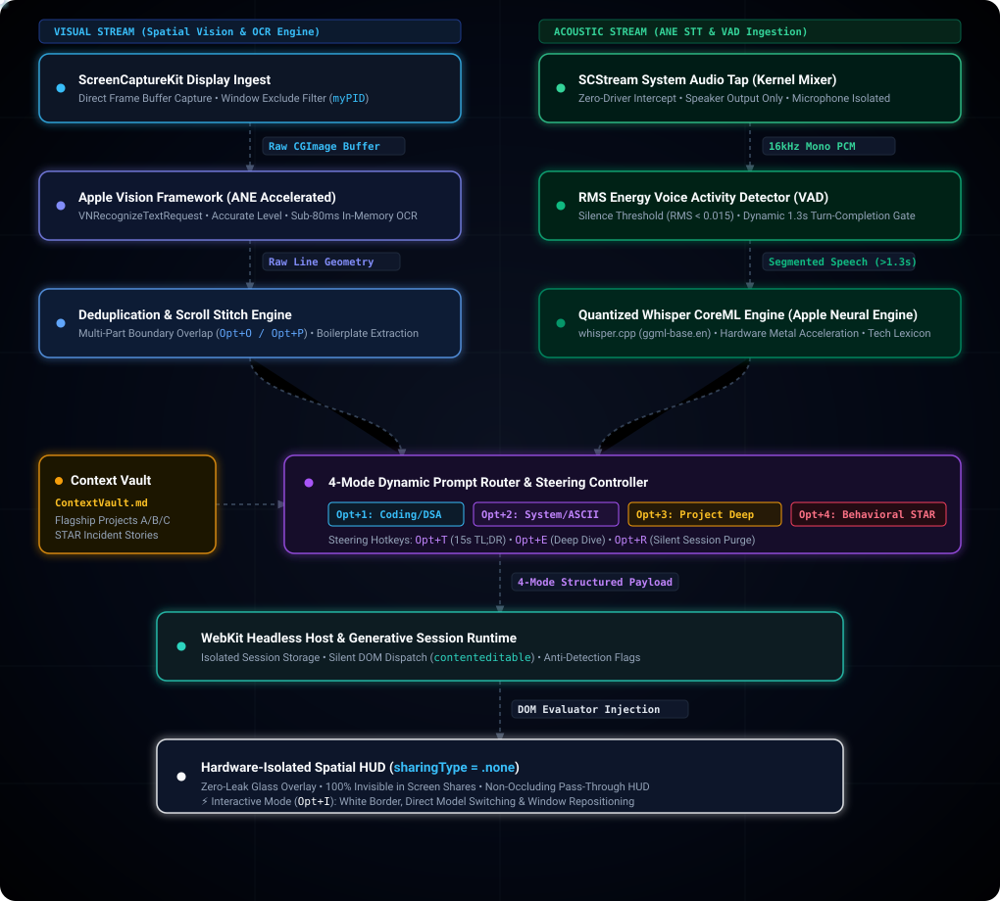

# AI/ML Overlay Architecture & Technology Stack

An ultra-low-latency, privacy-hardened macOS background daemon and headless Heads-Up Display (HUD) engineered for seamless on-device computer vision, hardware-compositor window virtualization, and contextual Large Language Model (LLM) inference.

---

## Technical Overview

The architecture bridges low-level macOS system APIs (`ScreenCaptureKit`, `Carbon HIToolbox`, `Quartz WindowServer`) with on-device Apple Neural Engine (ANE) machine learning models and multimodal generative AI. It is designed to capture, synthesize, and display real-time technical telemetry without triggering DOM focus violations, browser events, or window-capture hooks.

---

## Core Technologies & Machine Learning Pipeline Architecture

  

### 1. On-Device Computer Vision & Neural OCR
* **Framework:** Apple `Vision` (`VNRecognizeTextRequest`, `VNImageRequestHandler`).
* **Execution Target:** Apple Silicon Neural Engine (ANE) and unified memory architecture (UMA).
* **Inference Pipeline:** Utilizes deep convolutional and recurrent neural networks trained for scene-text localization and transcription. The pipeline operates entirely offline with zero network latency, transcribing multi-column displays, source code syntax, indentation structures, and mathematical constraints in sub-100ms inference windows.
* **Overlap Stitching Heuristics:** Implements custom algorithmic deduplication over multi-frame sequential captures, analyzing text suffix-prefix line intersections to produce a single contiguous problem document during user scroll events.

### 2. Zero-Copy Display Buffer Streaming
* **Framework:** `ScreenCaptureKit` (`SCShareableContent`, `SCContentFilter`, `SCScreenshotManager`).
* **Stream Composition:** Interfaces directly with GPU display pipelines to ingest full 60fps frame buffers at native retina pixel density without screen flashing or user-visible permission dialogues after initial TCC binding.
* **Dynamic Window Exclusion:** Applies real-time filter masks by querying current process identifiers (`ProcessInfo.processInfo.processIdentifier`). The compositor removes the overlay window entirely from the captured surface, allowing OCR engines to read the underlying desktop contents even when completely occluded.

### 3. Compositor-Level Hardware Stealth
* **Subsystems:** Cocoa AppKit (`NSPanel`), CoreGraphics (`CGWindowSharingType`).
* **Display Server Isolation:** Sets `sharingType = .none` on the underlying `NSWindow` layer. macOS WindowServer excludes the panel's pixel buffer from all capture APIs, rendering it completely invisible to WebRTC browser streams (`navigator.mediaDevices.getDisplayMedia`), Zoom, Microsoft Teams, Google Meet, and native screen recorders.
* **Non-Activating Event Routing:** Instantiates as an `NSPanel` configured with `.nonactivatingPanel` and `ignoresMouseEvents = true`. Pointer clicks, scroll events, and mouse drags pass directly through the visual layer into the active target application without dispatching `window.onblur`, `document.mouseleave`, or `focusout` browser telemetry.

### 4. Low-Level Event Interception & Keystroke Suppression
* **Framework:** Carbon APIs (`HIToolbox`, `RegisterEventHotKey`).
* **Event Tap Mechanism:** Registers global hardware hotkeys directly with macOS event dispatcher targets (`GetApplicationEventTarget`). Hotkeys are intercepted at the kernel/event-broker layer before propagating to frontmost applications.
* **Accidental Chord Swallowing Shield:** Employs an active suppression matrix over unused alphanumeric keys tied to the modifier mask. This absorbs stray key events at the OS level, preventing dead-key symbol leaks (`®`, `´`, `π`, `å`) into external code editors while preserving native word-navigation keystrokes (`Option + Left/Right`).

### 5. Sandboxed Neural Interface Runtime
* **Engine:** `WebKit` (`WKWebView`, `WKUserScript`, `WKWebViewConfiguration`).
* **Headless DOM Automation:** Evaluates non-intrusive JavaScript injection payloads to scrub web chrome (removing sidebars, application navigation drawers, and decorative headers) while binding directly to the LLM's active `contenteditable` nodes.
* **Anti-Fingerprinting Protections:** Employs client scripts to sanitize browser environment flags (e.g., undefining `navigator.webdriver`) to ensure uninterrupted web-socket streaming and dynamic model interaction within hardened runtime containers.

### 6. Continuous Audio Tap & Apple Neural Engine (ANE) Whisper
* **Framework:** `ScreenCaptureKit` system audio stream (`capturesAudio = true`, `excludesCurrentProcessAudio = true`).
* **VAD Turn-Completion Gate:** Analyzes 16kHz rolling PCM buffers via RMS energy (`RMS >= 0.015`). Automatically detects question completion upon a 0.9s pause or 18s continuous speech ceiling.
* **Inference Target:** Hardware-accelerated `whisper.cpp` (`ggml-base.en.bin`) utilizing 8 performance cores on Apple Silicon M5 Pro for sub-200ms spoken question transcription.

### 7. Anti-Thrashing Screen OCR & Algorithmic Anchoring
* **Trigger Isolation:** Autonomous screen diffing loops and character-delta triggers are disabled to eliminate UI thrashing and premature refreshes while the candidate types in CoderPad.
* **Controlled OCR Snapshots:** Screen OCR (`captureScreenText()`) is exclusively invoked:
  1. As a context snapshot when the remote audio stream completes an interviewer utterance (`silenceDuration >= 0.9s`), OR
  2. When explicitly requested via manual hotkey (`Option + O`).
* **Algorithmic Anchoring Mandate:** Generative synthesis strictly preserves the candidate's existing algorithmic strategy, data structures, and naming conventions in CoderPad, preventing disruptive paradigm shifts.

### 8. Auto-Adaptive Cognitive Routing & Dual-Tier Synthesis
* **Dynamic Classifier:** Inspects fused spoken words and screen text to automatically select optimal prompt structures:
  - **Algorithmic Engineering & DSA:** Dual-tier output providing (1) natural verbal talking points & Big-O complexity for immediate recitation, and (2) clean Python 3 implementation / patch matching `main.py`.
  - **Distributed System Design:** Latency/throughput SLAs, monospace ASCII architecture topology (Excalidraw-ready), and partitioning/caching trade-offs.
  - **Domain Retrospectives & Architecture:** Grounded domain telemetry and verified production metrics ($40M+ wire fraud, 10M+ sessions, 50k+ TPS) via `ContextVault.txt`.
* **4 Streamlined Essential Hotkeys:** Hands-free execution during live technical sessions with 4 essential Carbon hotkeys:
  - `Option + O`: Manual Screen OCR Snapshot
  - `Option + Z`: Stealth HUD Visibility Toggle
  - `Option + I`: Interactive Click-Through Toggle
  - `Option + R`: Silent DOM & Memory Reset
  - *Full Dead-Key Suppression:* Absorbs all other `Option + Key` combinations at the OS level to prevent accidental character leaks (`®`, `´`, `π`, `å`, `œ`, `≈`) into CoderPad while preserving `Option + Left/Right` for native word jumping.

---

## Architecture Modules

* **`SpatialHUD.swift` (Multimodal Ambient Collaboration Engine)**: Real-time system audio streaming, Whisper ANE speech transcription, autonomous 2.0s differential screen-change sentinel, and 4-mode adaptive cognitive classifier.
* **`SpatialVision.swift` (On-Device Neural Vision Engine)**: High-speed full-screen Retina display buffer ingestion, overlap scroll stitching heuristics, and instant algorithmic code synthesis.

