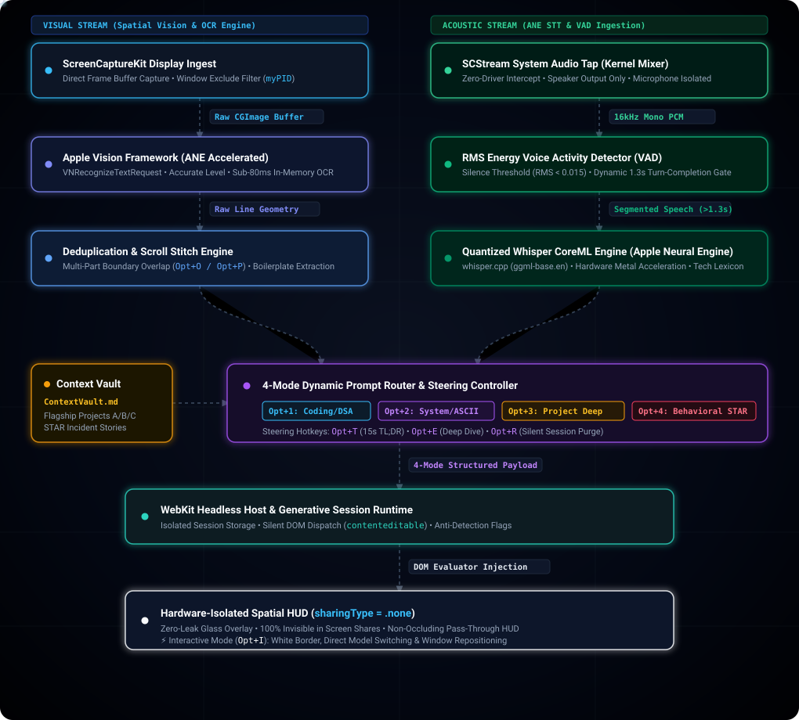

# AI/ML Overlay Architecture & Technology Stack

An ultra-low-latency, privacy-hardened macOS background daemon and headless Heads-Up Display (HUD) engineered for seamless on-device computer vision, hardware-compositor window virtualization, and contextual Large Language Model (LLM) inference.

---

## Technical Overview

The architecture bridges low-level macOS system APIs (`ScreenCaptureKit`, `Carbon HIToolbox`, `Quartz WindowServer`) with on-device Apple Neural Engine (ANE) machine learning models and multimodal generative AI. It is designed to capture, synthesize, and display real-time technical telemetry without triggering DOM focus violations, browser events, or window-capture hooks.

---

## Core Technologies & Machine Learning Pipeline Architecture

  

### 1. On-Device Computer Vision & Neural OCR
* **Framework:** Apple `Vision` (`VNRecognizeTextRequest`, `VNImageRequestHandler`).
* **Execution Target:** Apple Silicon Neural Engine (ANE) and unified memory architecture (UMA).
* **Inference Pipeline:** Utilizes deep convolutional and recurrent neural networks trained for scene-text localization and transcription. The pipeline operates entirely offline with zero network latency, transcribing multi-column displays, source code syntax, indentation structures, and mathematical constraints in sub-100ms inference windows.
* **Overlap Stitching Heuristics:** Implements custom algorithmic deduplication over multi-frame sequential captures, analyzing text suffix-prefix line intersections to produce a single contiguous problem document during user scroll events.

### 2. Zero-Copy Display Buffer Streaming
* **Framework:** `ScreenCaptureKit` (`SCShareableContent`, `SCContentFilter`, `SCScreenshotManager`).
* **Stream Composition:** Interfaces directly with GPU display pipelines to ingest full 60fps frame buffers at native retina pixel density without screen flashing or user-visible permission dialogues after initial TCC binding.
* **Dynamic Window Exclusion:** Applies real-time filter masks by querying current process identifiers (`ProcessInfo.processInfo.processIdentifier`). The compositor removes the overlay window entirely from the captured surface, allowing OCR engines to read the underlying desktop contents even when completely occluded.

### 3. Compositor-Level Hardware Stealth
* **Subsystems:** Cocoa AppKit (`NSPanel`), CoreGraphics (`CGWindowSharingType`).
* **Display Server Isolation:** Sets `sharingType = .none` on the underlying `NSWindow` layer. macOS WindowServer excludes the panel's pixel buffer from all capture APIs, rendering it completely invisible to WebRTC browser streams (`navigator.mediaDevices.getDisplayMedia`), Zoom, Microsoft Teams, Google Meet, and native screen recorders.
* **Non-Activating Event Routing:** Instantiates as an `NSPanel` configured with `.nonactivatingPanel` and `ignoresMouseEvents = true`. Pointer clicks, scroll events, and mouse drags pass directly through the visual layer into the active target application without dispatching `window.onblur`, `document.mouseleave`, or `focusout` browser telemetry.

### 4. Low-Level Event Interception & Keystroke Suppression
* **Framework:** Carbon APIs (`HIToolbox`, `RegisterEventHotKey`).
* **Event Tap Mechanism:** Registers global hardware hotkeys directly with macOS event dispatcher targets (`GetApplicationEventTarget`). Hotkeys are intercepted at the kernel/event-broker layer before propagating to frontmost applications.
* **Accidental Chord Swallowing Shield:** Employs an active suppression matrix over unused alphanumeric keys tied to the modifier mask. This absorbs stray key events at the OS level, preventing dead-key symbol leaks (`®`, `´`, `π`, `å`) into external code editors while preserving native word-navigation keystrokes (`Option + Left/Right`).

### 5. Sandboxed Neural Interface Runtime
* **Engine:** `WebKit` (`WKWebView`, `WKUserScript`, `WKWebViewConfiguration`).
* **Headless DOM Automation:** Evaluates non-intrusive JavaScript injection payloads to scrub web chrome (removing sidebars, application navigation drawers, and decorative headers) while binding directly to the LLM's active `contenteditable` nodes.
* **Anti-Fingerprinting Protections:** Employs client scripts to sanitize browser environment flags (e.g., undefining `navigator.webdriver`) to ensure uninterrupted web-socket streaming and dynamic model interaction within hardened runtime containers.

### 6. Deterministic Session Audio Tap & Whisper ANE
* **Framework:** `ScreenCaptureKit` system audio stream (`capturesAudio = true`, `excludesCurrentProcessAudio = true`).
* **Manual Session Capture Engine & 5s Pre-Roll Buffer:** Eliminates brittle VAD auto-triggers. Continuously maintains a 5-second rolling pre-roll buffer (80,000 floats) during idle listening so no opening words are lost when recording starts. Engaging recording via `Option + S` prepends the pre-roll, stops active generation via `button[aria-label*="Stop"]`, and `Option + Return` stops & solves. Audio buffers remain safe up to 10 minutes (16000 samples/sec * 600s).
* **Multi-Turn Follow-Up Framing:** Automatically tracks round iterations (`solveCount`); follow-up questions in the same session produce targeted code patches and conceptual talking points without rewriting unchanged code.
* **Inference Target:** Hardware-accelerated `whisper.cpp` (`ggml-base.en.bin`) utilizing 8 performance cores on Apple Silicon M5 Pro for sub-200ms spoken question transcription.

### 7. Anti-Thrashing Screen OCR & Algorithmic Anchoring
* **Trigger Isolation:** Autonomous screen diffing loops and character-delta triggers are disabled to eliminate UI thrashing and premature refreshes while the candidate types in CoderPad.
* **Controlled OCR Snapshots:** Screen OCR (`captureScreenText()`) is exclusively invoked:
  1. As a context snapshot when stopping an active session recording (`Option + Return: Stop & Solve`), OR
  2. As a direct single-shot screen capture when `Option + Return` is pressed without an active recording.
* **Algorithmic Anchoring Mandate:** Generative synthesis strictly preserves the candidate's existing algorithmic strategy, data structures, and naming conventions in CoderPad, preventing disruptive paradigm shifts.

### 8. Explicit Mode Routing & Live Prompt Synthesis
* **Interview Mode Engine (Coding Locked as Default):** The system initializes to **Coding / DSA** by default with autonomous switching disabled to prevent accidental prompt mutations. The candidate explicitly switches formats via dedicated numeric Carbon hotkeys:
  - **Option + 1 (Coding / DSA - Default):** Ultra-lean prompt synthesis (~200 tokens) with `ContextVault.md` and base instructions completely stripped; delivers immediate verbal talking points (restate problem, 2 edge cases, optimal approach with Big-O intuition), clean Python 3 implementation matching CoderPad signature, and 1-sentence complexity analysis in sub-second streaming latency. Includes a dedicated lean follow-up template for amendments.
  - **Option + 2 (System Design):** Capacity estimates, monospace ASCII architecture topology (optimized for Excalidraw / whiteboard), storage sharding, caching strategies, and resilience trade-offs.
  - **Option + 3 (Leadership & Behavioral):** Structured STAR methodology (Situation & Task 20s, 3 Leadership Actions 40s, Quantified Business Results 15s).
  - **Option + 4 (Past Project Retrospective):** Anchors strictly on `ContextVault.md` ground truth ($40M+ wire fraud, 10M+ sessions, 50k+ TPS), monospace ASCII architecture diagrams, production incident retrospective, and accepted trade-offs.
* **Streamlined Control Hotkeys:**
  - `Option + S`: Start Session Recording (Listening & Watching, vivid Amber/Red border, caches baseline screen OCR)
  - `Option + Return`: Stop Session & Solve (Runs Whisper ANE + final screen OCR in parallel, submits prompt; direct single-shot OCR if idle)
  - `Option + O`: Clean Quit Application (`exit(0)`)
  - `Option + Z`: Stealth HUD Visibility Toggle (Alpha 0.0 <-> 1.0)
  - `Option + I`: Interactive Click-Through Toggle (Click-through pass-through <-> Scrollable HUD)
  - `Option + R`: Silent DOM & Memory Reset (Purges session buffers & resets chat)
  - *Full Dead-Key Suppression:* Absorbs all other `Option + Key` combinations at the OS level to prevent accidental character leaks (`®`, `´`, `π`, `å`, `œ`, `≈`) into CoderPad while preserving `Option + Left/Right/Up/Down` for native cursor navigation.

### 9. Unified Full-Desktop Vision Engine & Zero-Focus Navigation
* **Unified Full-Screen OCR (`SpatialVision.swift`):** Eliminates rigid split-pane boundary heuristics (`midX <= 0.52`). Captures full Retina displays, sorts candidate lines strictly top-to-bottom (`$0.box.midY > $1.box.midY`), and deduplicates scrolling frames to support any browser layout or side/bottom console drawer.
* **Zero-Focus Remote HUD Navigation:** To prevent `window.onblur` focus-theft flags on proctored platforms (HackerRank, CoderPad):
  - **Remote JS Scrolling:** `Option + Down` (+350px) / `Option + Up` (-350px) injects DOM smooth scrolling into `WKWebView` without window activation.
  - **In-Place Window Scaling:** `Option + ]` (1.10x) / `Option + [` (0.90x) anchored to top/right margins using AppKit `setFrame` without stealing key focus.
  - **Stealth Opacity Controls:** `Option + =` (+0.10) / `Option + -` (-0.10) dynamically scales alpha between 20% stealth and 100% full clarity. `Option + Z` toggles visibility instantly.
  - **Opt-In Interactivity:** `Option + I` toggles manual mouse click-through (`ignoresMouseEvents = true` by default so browser clicks pass through unimpeded).
  - **Autonomic Biometric Typer:** Types solutions at 20 WPM Gaussian IKI with 4s hesitation, intentional typos, false starts, and safe retro-jumps.
* **SpatialVision Hotkey Map:**
  - `Option + S`: Solve & Autonomously Type solution (Zero focus)
  - `Option + T`: Full-Screen OCR & Diagnose Test Console Drawer (Zero focus)
  - `Option + Z`: Instant Stealth Visibility Toggle (`0.0` $\leftrightarrow$ `currentOpacity`)
  - `Option + -`: Decrease Window Opacity (-0.10 down to 20%)
  - `Option + =`: Increase Window Opacity (+0.10 up to 100%)
  - `Option + [`: Shrink Diagnostic HUD Window (0.90x)
  - `Option + ]`: Expand Diagnostic HUD Window (1.10x)
  - `Option + Down`: Remote Scroll Diagnostic Content Down 350px
  - `Option + Up`: Remote Scroll Diagnostic Content Up 350px
  - `Option + I`: Toggle Mouse Interactivity (Click & Select)
  - `Option + R`: Reset Session, Buffers & State to IDLE
  - `Option + X`: Panic Abort (<15ms instant typing halt)
  - `Option + Q`: Clean Quit Application
  - *Dead-Key Suppression:* Absorbs unassigned Option chords while preserving native text navigation (`Option + Left/Right Arrow`).

---

## Architecture Modules

* **`SpatialHUD.swift` (Multimodal Ambient Collaboration Engine)**: Real-time system audio streaming, 5s rolling pre-roll buffer, Whisper ANE speech transcription, manual session capture state machine (`Option + S` start, `Option + Return` stop & solve), multi-turn amendment framing (`solveCount`), and 4-mode adaptive cognitive routing (`Option + 1..4`).
* **`SpatialVision.swift` (On-Device Neural Vision Engine & Autonomous Typer)**: Unified full-desktop Retina display buffer ingestion, top-to-bottom text candidate sorting, scroll stitching heuristics, zero-focus remote HUD navigation, 13-key Carbon dead-key suppression matrix, and biometric human keyboard simulation.

